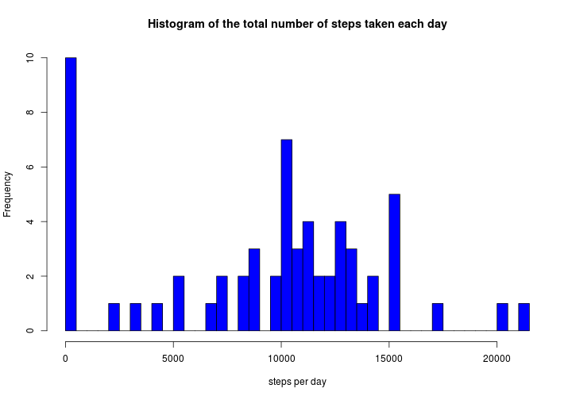

# "**JHU Course on Reproducible Research**"
## **Project: Analysis of Activity Monitoring Data**
 author: **Dmytro Dudenko**

### 1. Loading libraries we are going to use and preprocessing the data


```r
library(data.table)
library(dplyr)
library(lattice)
library(tidyr)

getwd()
setwd("~/JHU-courses/Course-5-W2/RepData_PeerAssessment1")

unzip(zipfile="./activity.zip",exdir="./")
activity <- read.table(file="./activity.csv", header = TRUE, sep=",")
```

### 2. What is mean total number of steps taken per day?


Calculating the total number of steps taken per day


```r
activity_clean <- group_by(activity, date)
activity_clean <- filter(activity_clean, !is.na(steps))
total_per_day <- summarize(activity_clean, total_steps = sum(steps))
```
Plotting a histogram of the total number of steps taken each day

```r
how_many_days <- length(total_per_day$total_steps)

hist(total_per_day$total_steps, xlab="steps per day", ylab="Frequency", breaks = how_many_days, col="blue", main="Histogram of the total number of steps taken each day")
```

 
Reporting mean and median values, respectively

```r
c(mean(total_per_day$total_steps),median(total_per_day$total_steps))
```

```
## [1] 10766.19 10765.00
```

### 3. What is the average daily activity pattern?

Plotting a time series plot

```r
activity_clean2 <- group_by(activity, interval)
activity_clean2 <- filter(activity_clean2, !is.na(steps))
avg_steps <-  summarize(activity_clean2, avg = mean(steps))

plot(avg_steps$interval, avg_steps$avg, type="l",
     xlab = "5-min Step Interval", ylab = "Average Number of Steps", main = "The Average Daily Activity Pattern",  col ="blue")
```

 
Finding out which 5-minute interval, on average across all the days in the dataset, contains the maximum number. Also plotting its value to make sure it is the one
of steps

```r
avg_steps[which(avg_steps$avg==max(avg_steps$avg)),]
```

```
## Source: local data frame [1 x 2]
## 
##   interval      avg
##      (int)    (dbl)
## 1      835 206.1698
```
### 4. Imputing missing values

 Calculate and report the total number of missing values in the dataset
 (the total number of rows with NAs)

```r
print(nrow(activity)-nrow(activity_clean2))
```

```
## [1] 2304
```

I decided to not givie any extra steps to the statistics.
Therefore, all missing values are 0 :)


```r
activity_clean3 <- activity
activity_clean3$steps[is.na(activity$steps)] = 0
```

Now I will prepare two histograms: with and without accounting for Na values.
Apparently, no difference. Although, the mean and medians values are dropping due to larger amount of dataset points.
Some days contain only Na values. So, large stick at 0 steps position.


```r
activity_clean3 <- group_by(activity_clean3, date)

total_per_day3 <- summarize(activity_clean3, total_steps = sum(steps))

hist(total_per_day$total_steps, ylim=c(0,10.0), xlab="steps per day", ylab="Frequency", breaks = how_many_days, col="blue", main="Histogram of the total number of steps taken each day")
```

 

```r
hist(total_per_day3$total_steps, ylim=c(0,10.0), xlab="steps per day", ylab="Frequency", breaks = how_many_days, col="blue", main="Histogram of the total number of steps taken each day")
```

 

```r
c(mean(total_per_day3$total_steps),median(total_per_day3$total_steps))
```

```
## [1]  9354.23 10395.00
```


###5. Are there differences in activity patterns between weekdays and weekends?

Unfortunately, my Ubuntu system call doesn't have sufficient priviledges
So, I don't know how to put english locale for this particular session without changing global system settings


```r
Sys.setenv(LANG = "en_US.UTF-8")
Sys.setlocale("LC_TIME", "English")
```

```
## Warning in Sys.setlocale("LC_TIME", "English"): OS meldet: Anfrage
## Lokilisierung auf "English" zu setzen kann nicht beachtet werden
```

Anyway, we shall proceed with the german Samstag and Sonntag as weekend days


```r
activity_clean4 <- mutate(activity_clean3, WDAY = weekdays(as.Date(date)))
activity_clean4$DTYPE <-ifelse(!(activity_clean4$WDAY %in% c("Samstag","Sonntag")), "weekday", "weekend")

activity_clean4 <- group_by(activity_clean4, interval)
activity_wday <-  filter(activity_clean4, DTYPE == "weekday")
activity_wend <-  filter(activity_clean4, DTYPE == "weekend")
avg_wday <-  summarize(activity_wday, avg = mean(steps), DTYPE = "weekday")
avg_wend <-  summarize(activity_wend, avg = mean(steps), DTYPE = "weekend")

avg_week <- rbind(avg_wday, avg_wend)

xyplot(avg ~  interval | DTYPE, data = avg_week, layout = c(1,2), type ="l", ylab="Number of Steps")
```

 
